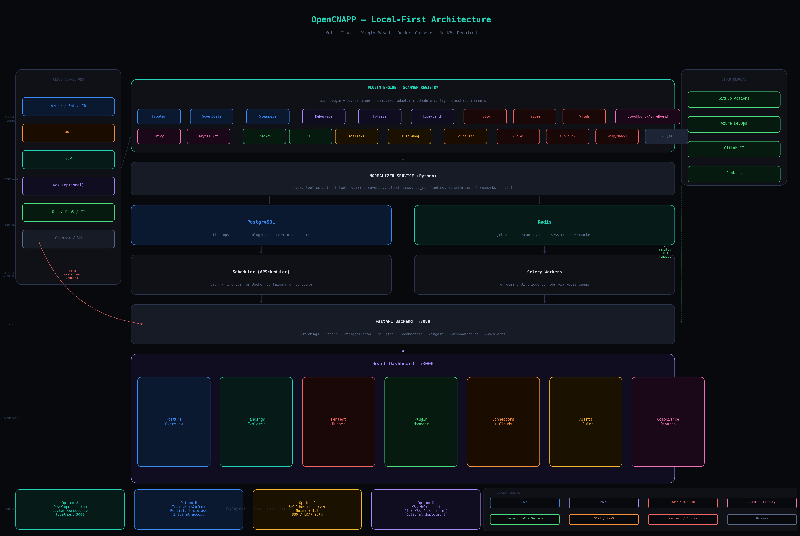

# OpenCNAPP

OpenCNAPP is an open, local-first CNAPP platform that unifies posture, vulnerability, runtime, CI/CD, and native cloud-security findings in one system.

## 1) What you get
- FastAPI backend for findings, scans, plugins, connectors, compliance, reports, auth, alerts/rules, attack paths, and native ingest.
- Plugin-driven scanner model (YAML + adapter).
- Multi-cloud connector model (Azure, AWS, GCP, Kubernetes, On-prem).
- Celery + APScheduler orchestration with Docker-capable runner.
- React dashboard with overview, findings explorer, alerts, attack paths, pentest runner, connectors and plugin manager.
- Docker Compose profiles for core, runtime (Falco), and CIEM (BloodHound/AzureHound).
- Helm chart baseline for Kubernetes deployment.
- CI test workflow + GHCR publish + supply-chain SBOM/attestation baseline workflows.

## 2) One-command setup
```bash
./scripts/setup_opencnapp.sh
```

Then open:
- API docs: http://localhost:8000/docs
- Dashboard: http://localhost:3000

## 3) Deployment modes
### Core
```bash
docker compose up -d
```

### Runtime profile (Falco + Falcosidekick)
```bash
docker compose --profile runtime up -d
```

### CIEM profile (BloodHound + AzureHound)
```bash
docker compose --profile ciem up -d
```

## 4) Architecture and plan mapping
- Spec + roadmap source: `raw cnapp idea/opencnapp_final_spec_v3.md`
- Final plan HTML: `raw cnapp idea/opencnapp_final_plan_v3.html`
- Architecture diagrams:
  - `raw cnapp idea/cnapp_architecture.svg`
  - `raw cnapp idea/opencnapp_architecture.png`
- How to use the plan in this repo: `docs/how-to-use-architecture-plan.md`
- Roadmap completion status: `docs/roadmap-gap-analysis.md`

## 5) API capabilities
- `/findings` CRUD-ish lifecycle (status/assignment/ticket fields)
- `/ingest/{tool}` normalized ingest and fingerprint dedup
- `/native-ingest/{provider}` native security source ingest (AWS/Azure/GCP)
- `/scans` trigger/list scans (active-scan authorization gate)
- `/plugins` sync/list/enable/configure
- `/connectors` upsert/test + CI pull endpoints (sonarqube/zap/snyk)
- `/dashboard/summary` posture KPIs + trends
- `/attack-paths` risk-ranked path graph payload
- `/alerts/rules` + `/alerts/test` Apprise-backed notification rules
- `/reports/csv` + `/reports/pdf`
- `/compliance/heatmap`
- `/auth/login` + `/auth/me`
- `/ws/alerts` + `/ws/scan-progress`

## 6) Plugin model
To add a new tool:
1. Create `plugins/<tool>/plugin.yaml`.
2. Implement `api/adapters/<tool>.py`.
3. Register it in `api/adapters/registry.py`.
4. Sync plugins (`POST /plugins/sync`) or restart API.

## 7) Resource requirements and OS support
See: `docs/feasibility-and-requirements.md`

Summary:
- Linux/macOS/Windows(WSL2) supported.
- Minimum: 4 vCPU / 8GB RAM / 20GB disk.
- Recommended team setup: 8 vCPU / 16GB RAM / 100GB SSD.

## 8) Security and operations notes
- Credentials are encrypted at rest using `api/crypto.py`.
- JWT auth included (local users); move to OIDC for enterprise SSO.
- Supply-chain baseline workflow added (`.github/workflows/supply-chain.yml`).

## 9) CI/CD and release workflows
- CI tests: `.github/workflows/ci.yml`
- GHCR image publish: `.github/workflows/publish-ghcr.yml`
- Supply-chain SBOM/attestation baseline: `.github/workflows/supply-chain.yml`

## 10) Docs index
- Contributor guide: `docs/CONTRIBUTING.md`
- Plugin authoring: `docs/adding-a-plugin.md`
- Connector authoring: `docs/adding-a-connector.md`
- CI/CD snippets: `docs/ci-cd-snippets.md`
- Deep integration notes: `docs/deep-integration.md`
- Launch checklist: `docs/launch-checklist.md`


## 11) Visual preview



> Runtime UI screenshot capture is expected via browser tooling in environments where browser automation is available.


## 12) ExecPlan workflow for future runs
- Agent policy: `AGENTS.md`
- ExecPlan template: `.agent/PLANS.md`
- Create a task-specific plan before large changes and track validation evidence while implementing.
